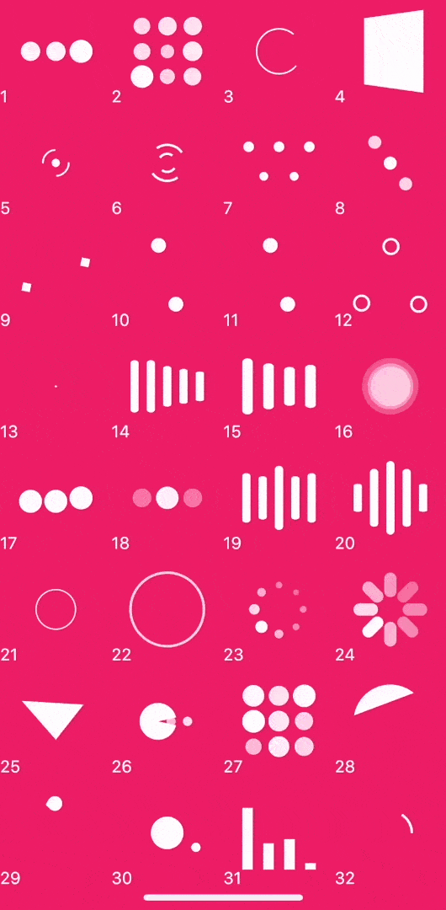

# LoadingIndicator

一个开箱即用的loading加载库，包含32个不同类型动画，灵感来源于[loaders.css](https://github.com/ConnorAtherton/loaders.css)和[NVActivityIndicatorView](https://github.com/ninjaprox/NVActivityIndicatorView)。

## Demo

现在你可以点击这个[地址](https://tinoguo.github.io/loading_indicator/)来进行预览.**3D效果在web上会失效.**

## 动画类型

| Type | Type | Type | Type |
|---|---|---|---|
|1. ballPulse | 2. ballGridPulse | 3. ballClipRotate | 4. squareSpin|
|5. ballClipRotatePulse | 6. ballClipRotateMultiple | 7. ballPulseRise | 8. ballRotate|
|9. cubeTransition | 10. ballZigZag | 11. ballZigZagDeflect | 12. ballTrianglePath|
|13. ballScale | 14. lineScale | 15. lineScaleParty | 16. ballScaleMultiple|
|17. ballPulseSync | 18. ballBeat | 19. lineScalePulseOut | 20. lineScalePulseOutRapid|
|21. ballScaleRipple | 22. ballScaleRippleMultiple | 23. ballSpinFadeLoader | 24. lineSpinFadeLoader|
|25. triangleSkewSpin | 26. pacman | 27. ballGridBeat | 28. semiCircleSpin|
|29. ballRotateChase | 30. orbit | 31. audioEqualizer | 32. circleStrokeSpin|

## 安装
从[pub](https://pub.dev/packages/loading_indicator)安装最新版本。

## 使用
使用很简单。

`LoadingIndicator(indicatorType: Indicator.ballPulse, color: Colors.white,)`

## 开源协议
[Apache 2.0](LICENSE)